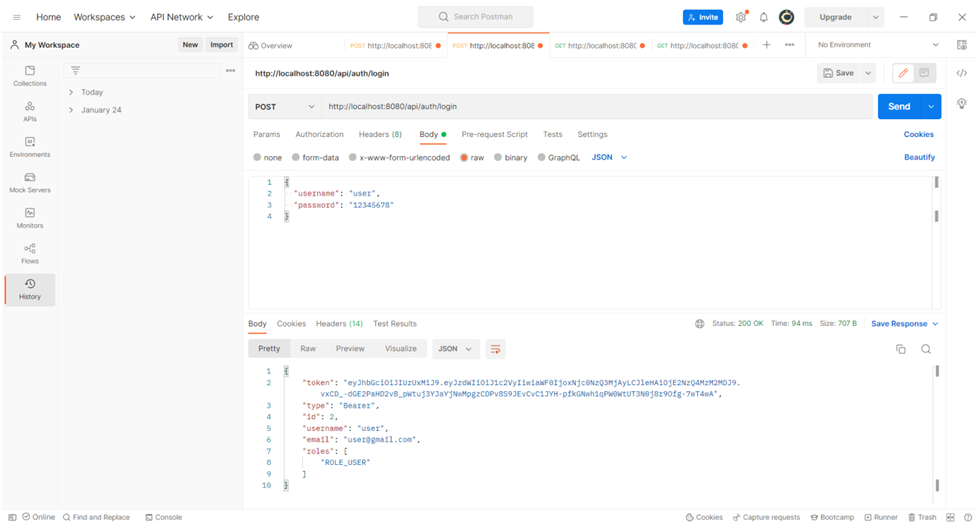
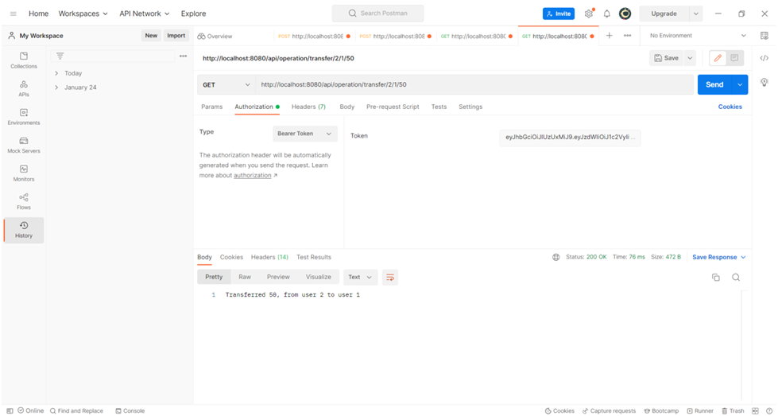
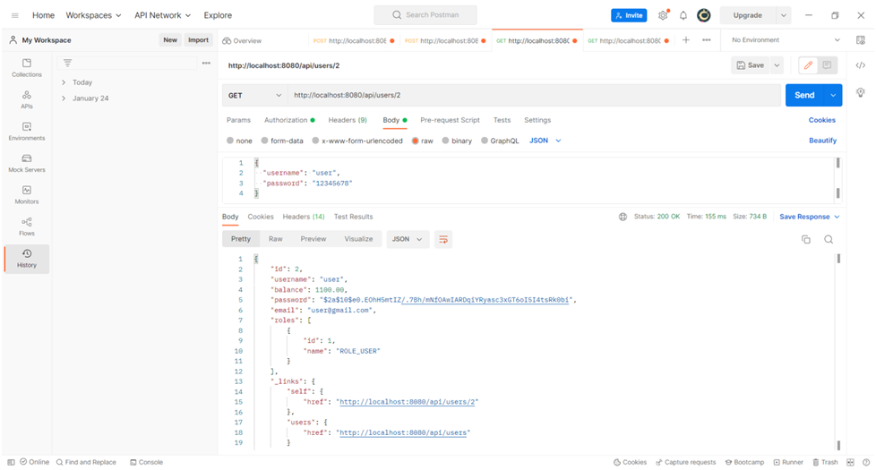

# bankAPI;

## Target

Implement an API for working with a bank account

Use: Spring Boot, maven, postgresql

## Project description

 The following operations will be available:

 * Find out the balance by user ID;
 * Withdrawing a specified amount from the user's balance;
 * Replenishment of the balance for a given amount;
 * Display a list of transactions for the selected period;
 * Transfer the specified amount to another user.

## To check the work you need:
* Create database bank_api_db
* Set up the application.properties file to connect to the database
  
  spring.datasource.url=jdbc:postgresql://localhost:5432/bank_api_db
  
  spring.datasource.username=postgres
  
  spring.datasource.password=****

* Fill in the table of roles
  
  INSERT INTO roles VALUES(1, 'ROLE_USER');
  
  INSERT INTO roles VALUES(2, 'ROLE_MODERATOR');
  
  INSERT INTO roles VALUES(3, 'ROLE_ADMIN');

## For authentication
(I use postman)
* POST http://localhost:8080/api/auth/login
  
  Content-Type: application/json

{

"username": "admin",

"password": "12345678"

}
 

## For authorization
To authorize the user, add Bearer Token by copying
from the response to the authentication request

## User operations
* Get a list of users
  
  GET http://localhost:8080/api/users
* Adding a user (only with ADMIN role)
  
  POST http://localhost:8080/api/users
  Content-Type: application/json

{

"username": "admin",

"email": "admin@gmail.com",

"password": "12345678"

}
* Deleting a user (only with ADMIN role and if he did not perform 
  operations on the account)
  
  DELETE http://localhost:8080/api/users/{{userId}}
* User editing
  
  PUT http://localhost:8080/api/users/{{userId}}

Account transactions

* Getting the user's balance
  
  GET http://localhost:8080/api/operation/balance/{{userId}}
  
* Replenishment of the user's account
  
  GET http://localhost:8080/api/operation/refill
  /{{userId}}/{{putMoney}}
  
* Withdrawal from the user's account
  
  GET http://localhost:8080/api/operation/deduct/{{userId}}/{{takeMoney}}
  
* Transfer between users
  
  GET http://localhost:8080/api/operation/transfer/{{userIdFrom}}/
  {{userIdFor}}/{{transferAmount}}
  
* Obtaining statistics on operations for the period
  
  GET http://localhost:8080/api/operation/getStats/
  getStats?userId=_&fromDate=yyyy-MM-dd&beforeDate=yyyy-MM-dd
