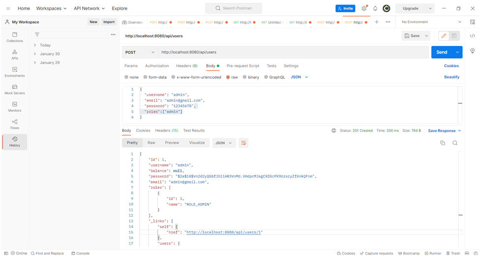

# bankAPI;

## Target

* Implement an API for working with a bank account
* Implement authentication and authorization

Use: Spring Boot, maven, postgresql

## Project description

The following operations are available:

* Find out the balance by user ID;
* Withdraw the specified amount from the user's balance;
* Top up the balance for a given amount;
* Display a list of transactions for the selected period;
* Transfer the specified amount to another user.

## Check the application:
* Create database bank_api_db
* Set up the application.properties file to connect to the database.
  
  spring.datasource.url=jdbc:postgresql://localhost:5432/bank_api_db
  
  spring.datasource.username=postgres
  
  spring.datasource.password=****

* Run the program

* Fill in the table of roles
  
  INSERT INTO roles VALUES(1, 'ROLE_USER');
  
  INSERT INTO roles VALUES(2, 'ROLE_MODERATOR');
  
  INSERT INTO roles VALUES(3, 'ROLE_ADMIN');

* Add user
  (I use postman)

  POST http://localhost:8080/api/users
  Content-Type: application/json

{

"username": "admin",

"email": "admin@gmail.com",

"password": "12345678",

"roles":["admin"]

}

{

"username": "user",

"email": "user@gmail.com",

"password": "12345678",

"roles":["user"]

}

* Add user balance

UPDATE users SET balance=1000

* Add operations users

INSERT INTO operation_list VALUES (10, '2022-10-05',100.00, 'Deducted', 1);

INSERT INTO operation_list VALUES (11, '2022-10-06',200.00, 'Contributed', 2);

INSERT INTO operation_list VALUES (12, '2022-10-07',500.00, 'Deducted', 1);

INSERT INTO operation_list VALUES (13, '2022-10-08',100.00, 'Contributed', 2);

INSERT INTO operation_list VALUES (14, '2022-10-09',300.00, 'Deducted', 1);

## For authentication
(I use postman)
 POST http://localhost:8080/api/auth/login
  
  Content-Type: application/json

{

"username": "admin",

"password": "12345678"

}
 

## For authorization
To authorize the user, add Bearer Token by copying
from the response to the authentication request

## User operations
* Get a list of users
  (only ADMIN)
  
  GET http://localhost:8080/api/users
  
* Add user 
  (all)
  
  POST http://localhost:8080/api/users
  Content-Type: application/json

{

"username": "admin",

"email": "admin@gmail.com",

"password": "12345678",

"roles":["admin"]

}

* Delete user 
  (only with ADMIN role and if he did not perform 
  operations on the account)
  
  DELETE http://localhost:8080/api/users/{{userId}}
  
* Edit user
  (only ADMIN)
  
  PUT http://localhost:8080/api/users/{{userId}}

## Account transactions

* Getting the user's balance 
  (only ADMIN or USER with {userId})
  
  GET http://localhost:8080/api/operation/balance/{{userId}}
  
* Replenishment of the user's account 
  (only ADMIN or USER with {userId})
  
  GET http://localhost:8080/api/operation/refill/{{userId}}/{{putMoney}}
  
* Withdrawal from the user's account
  (only ADMIN)
  
  GET http://localhost:8080/api/operation/deduct/{{userId}}/{{takeMoney}}
  
* Transfer between users 
  (only ADMIN or USER with {userIdFrom})
  
  GET http://localhost:8080/api/operation/transfer/{{userIdFrom}}/{{userIdFor}}/{{transferAmount}}
  
* Obtaining statistics on operations for the period
  (only ADMIN or USER with {userId})

  GET http://localhost:8080/api/operation/getStats/getStats?userId=_

  or

  GET http://localhost:8080/api/operation/getStats/getStats?userId=_&fromDate=yyyy-MM-dd&beforeDate=yyyy-MM-dd

 ## I continue to develop this project